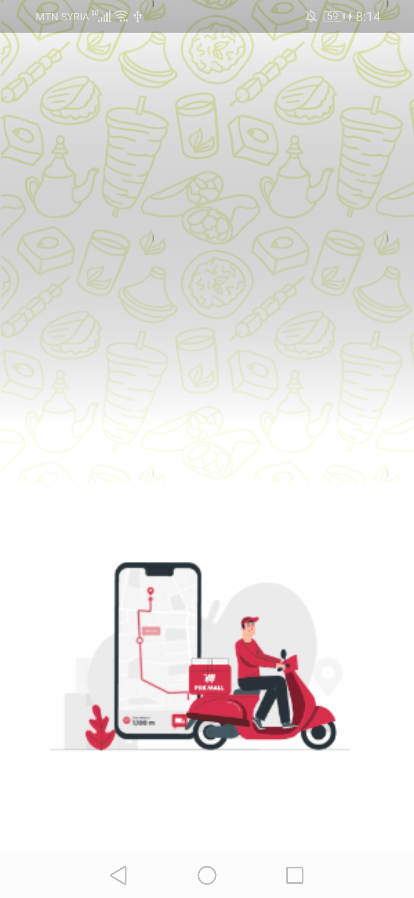
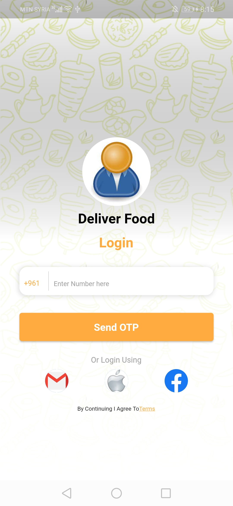
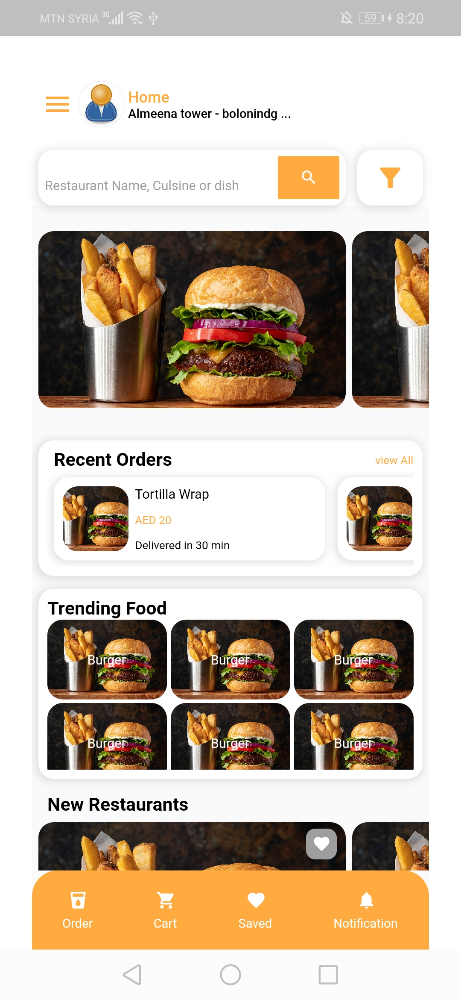
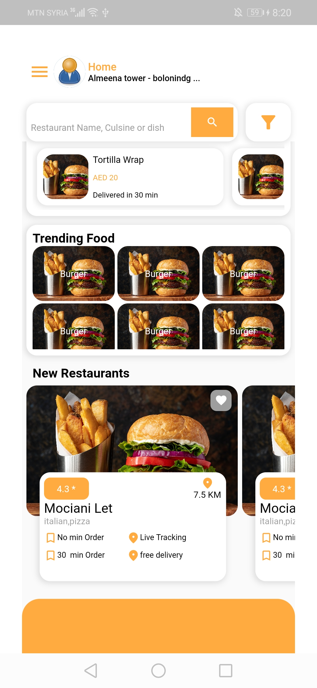
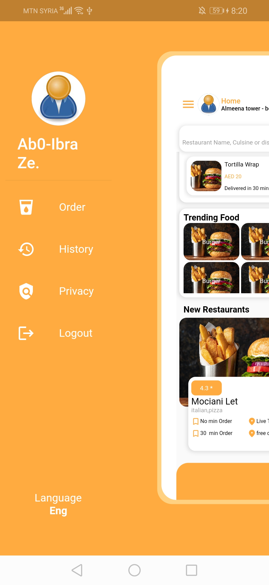

# delivery_restaurants

A new Flutter project.

## This project is a delivery app UI developed with Flutter.

  

 

 *gif image for onboarding screens.
  
 *valueNotifier to hide and show bottomNavigationBar icons when scrolling up and down

 *Animated positioned with transformscale to create drawer animation

## To see other projects developed by me :

- [Portfolio](https://nadeemze.github.io/Portfolio/)

